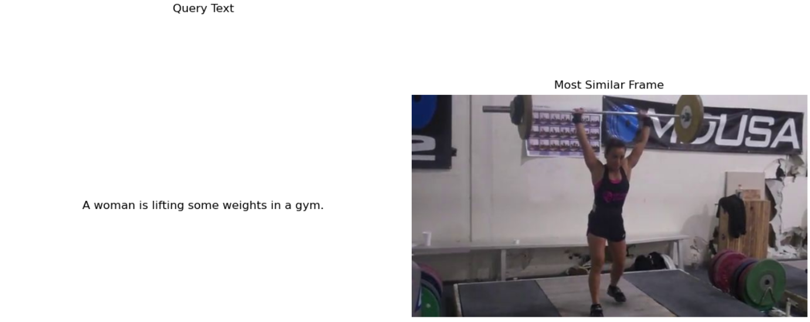
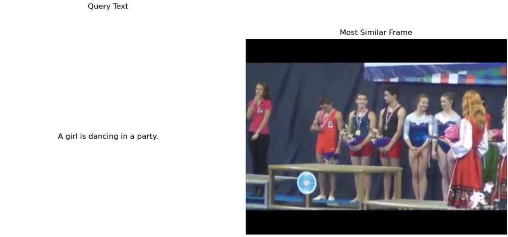
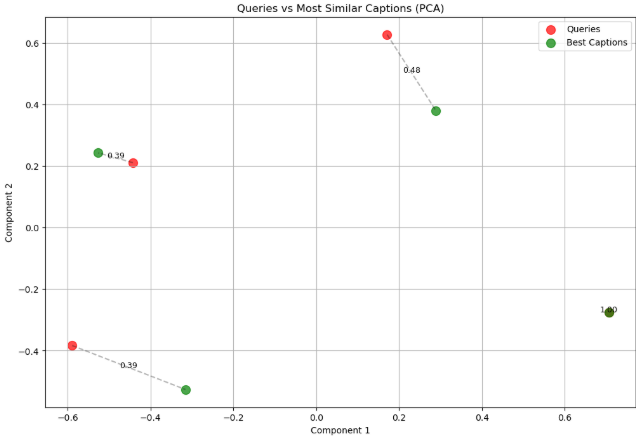
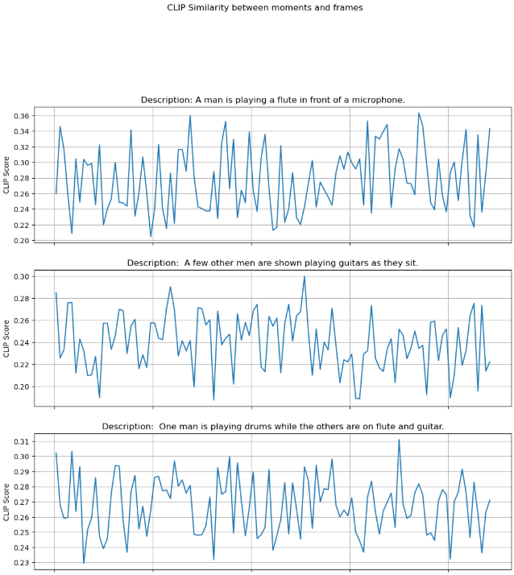

# VIDEO MOMENT RETRIEVAL SYSTEM
### Universidade Nova de Lisboa - Web Search and Data Mining (2024/2025)

## Multimodal Moment Retrieval and Conversational VQA (Visual Question Answering) in Videos

This project develops a complete pipeline for **video moment retrieval** using **Transformer-based architectures** (Dual Encoders, CLIP, LLaVA) and **OpenSearch** for efficient search and advanced cross-modal reasoning. The system allows users to search for specific video moments using natural language and answer complex questions grounded in video content.

---

## 1. Key Features

* **Semantic Video Search (Phase 1):** Efficiently retrieve relevant video moments based on natural language queries using **Dual Encoders** and OpenSearch $k$-NN vector search.
* **Cross-Modal Retrieval (Phase 2):** Use the **CLIP** model to index video key-frames by visual content and support retrieval with text-to-image and image-to-text queries.
* **Retrieval-Augmented Visual Question Answering (VQA) (Phase 2):** Integrate the **LLaVA** model to answer natural language questions about the content of retrieved video frames.
* **System Interpretability:** Includes visualizations for **embeddings neighborhood**, **contextual embeddings**, and **Language-Vision temporal similarity**.

### Demonstration: Moment Retrieval in Action

The system can precisely locate a video segment based on a complex description.

| Natural Language Query | Retrieved Video Moment (Key-Frame) |
| :--- | :--- |
| **"A woman is lifting some weights in a gym."** |  |
| **"A girl is dancing in a party."** |  |

---

## 2. Installation and Setup

This project requires **Docker** to run a local **OpenSearch** instance and a **Python Virtual Environment** for managing dependencies.

### 2.1. Prerequisites

* **Docker** and **Docker Compose** (essential for OpenSearch)
* **Python 3.8+**
* **Git**

### 2.2. Set up OpenSearch via Docker

The project relies on OpenSearch for indexing the video moments and embeddings.

1.  **Clone the repository and navigate to the project root:**
    ```bash
    git clone [YOUR_REPO_URL]
    cd VIDEO-MOMENT-RETRIEVAL-SYSTEM
    ```

2.  **Start the OpenSearch Container:**
    You must have a `docker-compose.yml` file (or similar setup, you can find those setup on Docker Website) configured to run OpenSearch locally on the default port (9200) with credentials (e.g., `admin:admin`).
    ```bash
    # Execute the Docker command to launch your Opensearch instance
    docker-compose up -d opensearch
    ```
    You must then active the container:
    ```bash
    sudo docker run -d --name opensearch-knn -p 9200:9200 -p 9600:9600 -e "discovery.type=single-node" -e "bootstrap.memory_lock=true" -e "OPENSEARCH_INITIAL_ADMIN_PASSWORD=[password]" --ulimit memlock=-1:-1 -v osdata:/usr/share/opensearch/data opensearchproject/opensearch:2.13.0
    ```
    *Ensure you wait until the container is fully running before proceeding.*

3.  **Verify OpenSearch Connection:**
    ```bash
    curl -XGET -u 'admin:admin' 'https://localhost:9200/?pretty' --insecure
    ```

### 2.3. Set up Python Environment

Working within a virtual environment is strongly recommended for dependency isolation.

1.  **Create the Virtual Environment:**
    ```bash
    python -m venv venv
    ```

2.  **Activate the Environment:**
    * **macOS/Linux:**
        ```bash
        source venv/bin/activate
        ```
    * **Windows:**
        ```bash
        .\venv\Scripts\activate.ps1
        ```

3.  **Install Requirements:**
    The necessary libraries (PyTorch, Transformers, OpenSearch Python Client, etc.) are listed in the `requirements.txt` file.
    ```bash
    pip install -r requirements.txt
    ```

---

## 3. Project Execution

The entire project workflow is contained within three sequential Jupyter Notebooks, corresponding to the phases outlined in the course guide.

1.  **Launch Jupyter Notebooks:**
    ```bash
    jupyter notebook
    ```

2.  **Execute the Notebooks Sequentially:** Run all cells in order for each notebook.

    * **`project-phase-1.ipynb` (Understanding Embedding Spaces):** This notebook handles the data parsing, the creation of text embeddings using **Dual Encoders**, and the indexing of the data into OpenSearch. **This must be run first.**
    * **`project-phase-2.ipynb` (Large Vision and Language Models):** This phase integrates visual features using **CLIP** (indexing key-frames) and implements the Retrieval Augmented VQA system using **LLaVA**.
    * **`project-phase-3.ipynb` (Group-Specific Idea):** Implementation of the final extension of the project: moment retrieval in videos using clustering.

---

## 4. Visualizations and Interpretability

Key visualizations were implemented to validate model understanding and system performance.

### Embeddings Neighborhood (Phase 1)

This figure demonstrates how the semantic embedding space, created by the Dual Encoder, organizes related concepts near each other, enabling effective semantic search.



### Language-Vision Temporal Similarity (Phase 2/3)

Visualization of the **CLIP similarity score** for a caption across all frames of a video, illustrating the precise moment of alignment between the text and the visual content.




## 5. Authors
- Marc LICHTNER: m.lichtner@campus.fct.unl.pt
- Lina LEKBOURI: l.lekbour@campus.fct.unl.pt
- Hugo WERCK: h.werck@campus.fct.unl.pt
